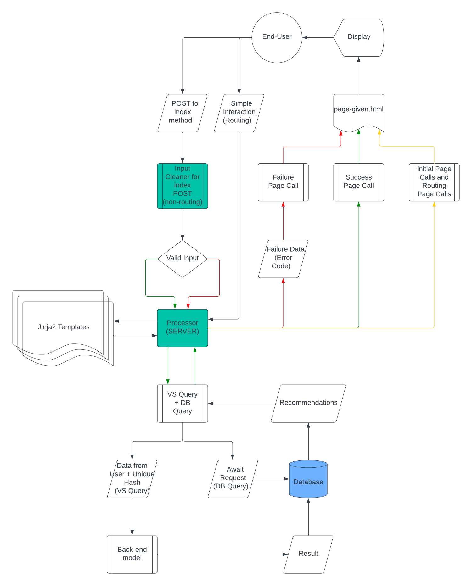

AI-Movie-Suggestions 🤖
=======================
> The overarching design of this product focuses on delivering a robust, sustainable deployed
> web application for discovering new media including shows & movies
### [Deployed site (to be) for AI movie suggestions!](https://127.0.0.1:5000/)


### Roadmap
\- Machine Learning model capable of processing data including movie & show titles, reviews, and transcripts 
\- Fully Deployed Rich Web Application 🌐    
\- API written in Python 💻    
\- Model output based on user-provided information including preferences, attributes, and other shows📺    
\- SQL Database     

### Tech

*******AI-Movie-Suggestions uses a number of libraries and frameworks to work properly:*******
- [Flask]() - Python Framework for web applications 🌎
- [Mozilla Developer Network (MDN)](https://developer.mozilla.org/en-US/docs/Web/JavaScript) - Comprehense JavaScript Guides and tools 📚
- [MACHINE LEARNING HERE] - Lorem Ipsum I'm a description
- [MACHINE LEARNING HERE] - Lorem Ipsum I'm a description
- [VIM Motions Guide](https://www.youtube.com/playlist?list=PLm323Lc7iSW_wuxqmKx_xxNtJC_hJbQ7R) - Great guide on VIM Motions from [ThePrimeAgen](https://github.com/ThePrimeagen) ⌨️
- [Dillinger](https://dillinger.io/) - Markdown editor 📝    
###Front-end-Server Model Diagram

###Developer Directory Structure Snapshot (7/25/2023)
```
├── LICENSE
├── README.md
├── assets
│   ├── dev-requirements.txt
│   └── requirements.txt
└── server
    ├── __pycache__
    │   └── app.cpython-310.pyc
    ├── app.py
    └── templates
        ├── about.html
        ├── base.html
        └── index.html
```

### Local Deployment

Initalize Venv install the dependencies and devDependencies from requirements.txt for back-end (assuming cloned from remote)

```sh
cd back-end
python3 -m venv [venvname]
source [venvname]/bin/activate
pip(3) install -r requirements.txt
```

Install dependencies and devDependencies from package.json for front-end

```sh
cd front-end
npm install
```

Setup SQL database
```sh
TO-DO*
TO-DO*
```

Run Application using Linux script (default hostname: http://localhost:3050/)
```sh
./start.sh
```

### Data Base table formats (TO-DO)

Dillinger is currently extended with the following plugins.
Instructions on how to use them in your own application are linked below.

| Example | Table | Example | Feature | Example Foreign |
| ------ | ------ | ------ | ------ | ------ |
| Example Key | Example Data | Example Data | Example Feature | Example Foreign Key |
| Example Key | Example Data | Example Data | Example Feature | Example Foreign Key |
| Example Key | Example Data | Example Data | Example Feature | Example Foreign Key |


### License

MIT License

